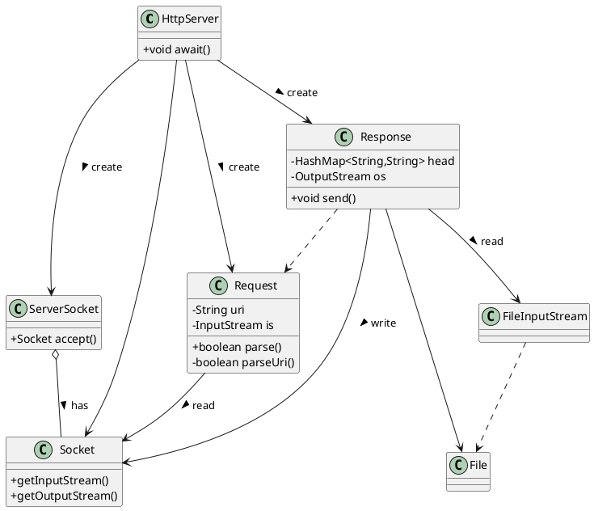
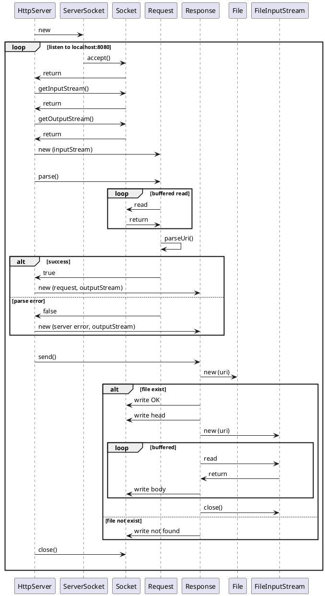

# 实现一个返回静态资源的Web服务器
目标：
- 使用`Socket`,`ServerSocket`实现
- 监听`localhost:8080`，返回`resources/static`下的静态资源
- 接收`HTTP GET`请求，请求行示例：`GET /asciiart.atxt HTTP/1.1`
- 不考虑并发，backlog=1
- 处理三种静态资源，html页面，txt文本，png图片

## 设计思路
- HttpServer类，应用主体，启动后监听端口8080，使用ServerSocket实现
- Request类，当HttpServer实例接收到请求，就会创建Request实例
- Request实例解析HTTP请求行，httpMethod，uri，httpVer
- HttpServer根据Request实例，创建Response实例
- Response类，对应HTTP的响应，响应行（httpVer，statusCode，status）
- Response类，响应头（head:HashMap<String,String>），Server，Date，Content-Type，Last-Modified，Content-Length
- Response类，CRLF行
- Response类，响应实体，静态资源本身

## UML

